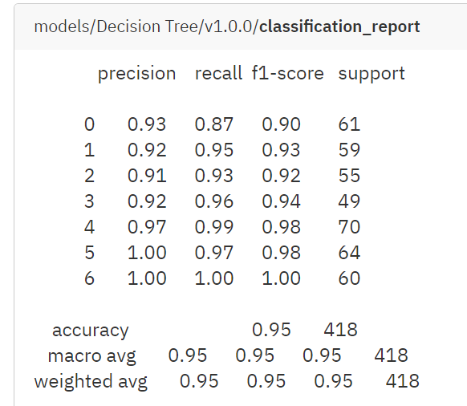
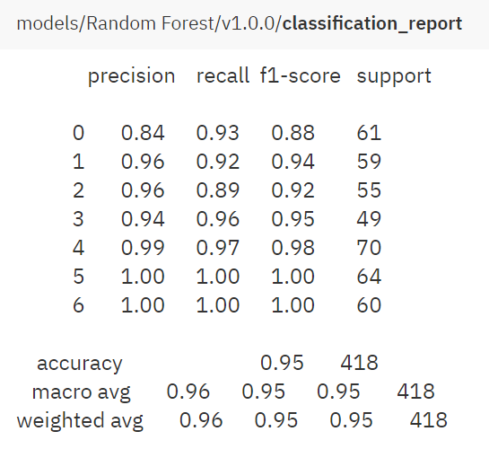
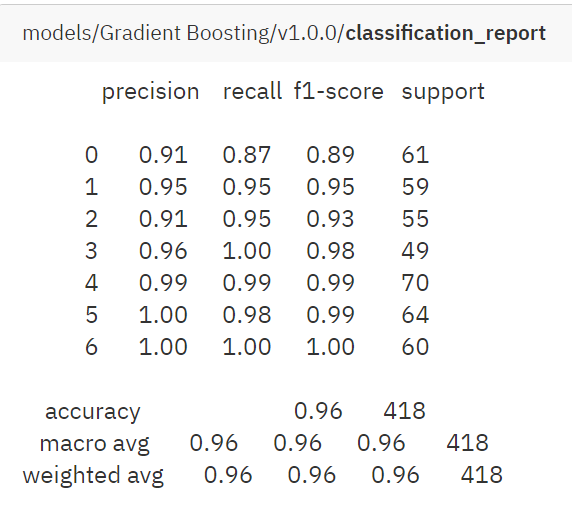

# Obesity Level Estimation using Machine Learning (Modelling Part)
Ini adalah step modelling dari repository berikut (https://github.com/nadyadtm/Obesity-Level-Estimation-using-Machine-Learning)

## Tentang Project
Tujuan dari pembuatan project ini adalah untuk membuat sistem yang dapat mengetahui seberapa besar tingkatan obesitas seseorang berdasarkan beberapa faktor seperti kondisi fisik dan kebiasaan seseorang.

## Langkah Pengerjaan
Berikut ini adalah langkah-langkah yang dilakukan dalam pembuatan sistem.
1. Exploratory Data Analysis, yang terdiri dari
    - Pengecekan Missing Values
    - Pengecekan Baris yang Duplikat
2. Data Preprocessing, yang terdiri dari
    - Penghapusan data duplikat
    - Encoding untuk Data Kategorikal
3. Data Splitting, membagi data menjadi data train dan data test.
3. Machine Learning Modelling

Untuk melihat proses EDA dan Data Preprocessing secara lengkap dapat melihat repository sebelumnya (https://github.com/nadyadtm/Obesity-Level-Estimation-using-Machine-Learning)

## Machine Learning Modelling
Selanjutnya kita akan mencari algoritma machine learning yang paling sesuai dengan kondisi data yang sudah di preprocessing sebelumnya. Langkah modelling yang dilakukan adalah sebagai berikut.

### Memilih Kandidat Algoritma Machine Learning
Dalam kasus ini, kita akan memilih tiga algoritma berikut ini. Di antaranya adalah
1. Decision Tree, dengan parameter `max_depth` 10 dan `criterion` entropy.
2. Random Forest, dengan parameter `n_estimators` 200 dan `criterion` entropy.
4. Gradient Boosting, dengan parameter `n_estimators` 200.

Semua algoritma ini merupakan model tree based, yaitu algoritma yang akan menghasilkan aturan bercabang. Aturan bercabang ini adalah hasil dari pembelajaran yang dilakukan oleh algoritma tersebut. 

## Evaluasi Algoritma Machine Learning
Pada step sebelumnya, kita sudah membagi data menjadi
1. Data Latih sebanyak 1669 data
2. Data Uji sebanyak 418 data

Data yang sudah dipreprocessing akan menjadi bahan untuk dipelajari oleh algoritma machine learning. Tiga model ini akan mempelajari data latih terlebih dahulu. Setelah itu kita akan menguji model tersebut untuk memprediksi data uji. Setelah itu kita perlu membandingkan hasil prediksi model kita dengan hasil dari data uji dengan menggunakan metrik evaluasi.

Dalam kasus ini, metrik evaluasi yang digunakan adalah F1 Score. Semakin besar F1 Score, artinya model berhasil memprediksi kelas dengan baik. Untuk mencatat dan memonitoring hasil evaluasi, kita dapat menggunakan tools Neptune.ai.

## Hasil Evaluasi
Berikut ini adalah hasil evaluasi yang dihasilkan oleh tiga model berikut
1. Decision Tree

2. Random Forest

3. Gradient Boosting

Berdasarkan hasil evaluasi tersebut, Gradient Boosting menghasilkan hasil yang terbaik dengan F1 Score 96%. Oleh karena itu, kita akan memilih Gradient Boosting.
